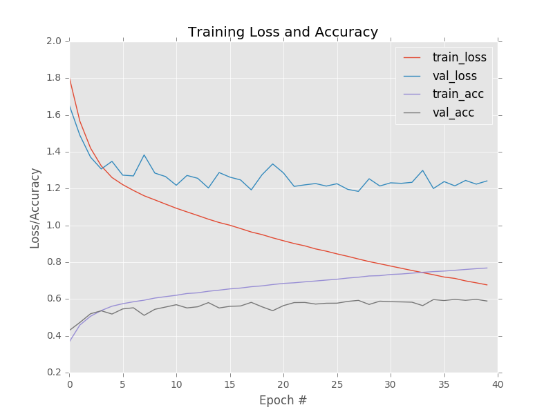
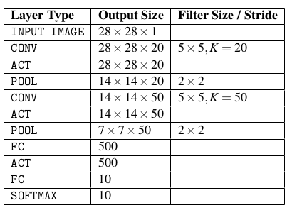

# Deep Learning Sandbox
A deep learning utilities library for organizing my thoughts, experiments, and development practice in Tensorflow 2.0. Free to use by all. 
Further Credit: Adrian Rosebrock 

# Table of contents
1. [Utility functions](#utility_functions)
2. [Experiments](#experiments)
   1. Computer Vision fundamentals
       - [k-NN: A Simple Classifier](#knn)
       - [Parameterized Learning (Linear Regression)](#linear_regression)
       - [Gradient Descent, SGD, Mini-batch SGD, Regularization](#gradient)
       - [Rules of thumb for Convolutional Neural Networks](#rules)
       - [A basic Neural net - Shallow net](#basic_nn)
       - [Loading and Saving models](#load_save)
       - [LeNet Architecture](#le_net)


# Utility functions <a name="utility_functions"></a>
1. **Preliminary Dataset loader:** 
   - This dataset loader is simple by design; however, it affords us the ability to apply any number of image preprocessors to every image in our dataset with ease. The only caveat of this dataset loader is that it assumes that all images in the dataset can fit into main memory at once. (To be expanded upon soon)


```
 simpledatasetloader.py
```

2. **Preliminary Data pre-processor:**
   - an image preprocessor that resizes the image, ignoring the aspect ratio. (For now)
```
 simplepreprocessor.py
```

3. **Image to array pre-processor:**
   - The Keras library provides the img_to_array function that accepts an input image and then properly orders the channels based on our image_data_format setting. Here we wrap this function inside a new class named ImageToArrayPreprocessor.
```
imagetoarraypreprocessor.py
```


*Note about preprocessors: There will be different classes of preprocessors that will allow us to create “chains” of preprocessors to efficiently prepare images for training and testing.*

```python

# The image preprocessors are chained together and will be applied in sequential order

# resize all input images to a fixed size of 32 × 32 pixels
sp = SimplePreprocessor(32, 32)
# apply the proper channel ordering
iap = ImageToArrayPreprocessor()
# load an image dataset from disk and prepare all images in the dataset for training
sdl = SimpleDatasetLoader(preprocessors=[sp, iap])
(data, labels) = sdl.load(imagePaths, verbose=500)
```

# Experiments: Utilize any of these scripts at the top level of the folder to reference the deepvision library <a name="experiments"></a>
## **1. **k-NN: A Simple Classifier**** <a name="knn"></a>
```
$ python knn.py --dataset ../datasets/animals
```

- [ ] Future Enhancement: Utilizing Nvidia Rapids cuML

## **2. Parameterized Learning** <a name="linear_regression"></a>

```
$ python linear_classifier.py
```

## **3. Gradient Descent, SGD, Mini-batch SGD, Regularization** <a name="gradient"></a>

``` 
$ python gradient_descent.py
$ python sgd.py
$ python regularization.py
```


## **4. Rules of thumb for Building ConvNets** <a name="rules"></a>


- The images presented to the input layer should be square. Using square inputs allows us to take advantage of linear algebra optimization libraries. Common input layer sizes include **32 × 32, 64 × 64, 96 × 96, 224 × 224, 227 × 227 and 229 × 229** (leaving out the number of channels for notational convenience).
- The input layer should also be divisible by two multiple times after the first **CONV** operation is applied. You can do this by tweaking your filter size and stride. The **“divisible by two rule"** enables the spatial inputs in our network to be conveniently down sampled via **POOL** operation in an efficient manner.
- Your CONV layers should use smaller filter sizes such as **3 × 3** and **5 × 5**. Tiny **1 × 1** filters are used to learn local features, but only in your more advanced network architectures. Larger filter sizes such as **7 × 7** and **11 × 11** may be used as the first CONV layer in the network (to reduce spatial input size, provided your images are sufficiently larger than **> 200 × 200** pixels); however, after this initial CONV layer the filter size should drop dramatically, otherwise you will reduce the spatial dimensions of your volume too quickly.
- You’ll also commonly use a stride of **S = 1** for **CONV** layers, at least for smaller spatial input volumes (networks that accept larger input volumes use a stride **S >= 2** in the first **CONV** layer to help reduce spatial dimensions). Using a stride of **S = 1** enables our **CONV** layers to learn filters while the **POOL** layer is responsible for downsampling. However, keep in mind that not all network architectures follow this pattern – some architectures skip **max pooling** altogether and rely on the **CONV** stride to reduce volume size.
- Apply zero-padding to **CONV** layers to ensure the output dimension size matches the input dimension size – the only exception to this rule is if you want to purposely reduce spatial dimensions via convolution. Applying zero-padding when stacking multiple **CONV** layers on top of each other has also demonstrated to increase classification accuracy in practice. Keras can automatically compute zero-padding for you, making it even easier to build CNN architectures.
- use **POOL** layers (rather than **CONV** layers) to reduce the spatial dimensions of your input, at least until you become more experienced constructing your own CNN architectures. Once you reach that point, you should start experimenting with using **CONV** layers to reduce spatial input size and try removing **max pooling** layers from your architecture.
- Most commonly, you’ll see **max pooling** applied over a 2 × 2 receptive field size and a stride of S = 2. You might also see a 3 × 3 receptive field early in the network architecture to help reduce image size. It is highly uncommon to see receptive fields larger than three since these operations are very destructive to their inputs.
- **Batch normalization** is an expensive operation which can double or triple the amount of time it takes to train your CNN; however, I recommend using **BN** in nearly all situations. While BN does indeed slow down the training time, it also tends to “stabilize” training, making it easier to tune other hyperparameters. Inserting BN into the common layer architectures above, they become:
  
       - INPUT => CONV => RELU => BN => FC

       - INPUT => [CONV => RELU => BN => POOL] * 2 => FC => RELU => BN => FC

       - INPUT => [CONV => RELU => BN => CONV => RELU => BN => POOL] * 3 => [FC => RELU => BN] * 2 => FC
  
  You do not apply **batch normalization** before the **softmax classifier** as at this point we assume our network has learned its discriminative features earlier in the architecture.

- **Dropout (DO)** is typically applied in between FC layers with a dropout probability of 50% – you should consider applying dropout in nearly every architecture you build. While not always performed, you can also include dropout layers (with a very small probability, 10-25%) between **POOL** and **CONV** layers. Due to the local connectivity of **CONV** layers, dropout is less effective here, but I’ve often found it helpful when battling overfitting.
- Once you master this **“traditional” method** of building Convolutional Neural Networks, you should then start exploring **leaving max pooling operations out entirely** and using just **CONV** layers to reduce spatial dimensions, eventually leading to **average pooling** rather than an **FC** layer


## **5. A Basic Neural Net - ShallowNet** <a name="basic_nn"></a>

```
python shallownet_cifar10.py
```

Loss and accuracy for ShallowNet trained on CIFAR-10. Our network obtains 60% classification accuracy; however, it is overfitting. Further accuracy can be obtained by applying regularization




## **6. Loading and Saving Models** <a name="load_save"></a>
Using the Keras library, model serialization is as simple as calling `model.save` on a trained model and then loading it via the `load_model` function.
```python
# save the network to disk
print("[INFO] serializing network...")
model.save(args["model"])

# load the pre-trained network
print("[INFO] loading pre-trained network...")
model = load_model(args["model"])

# make predictions on the images
print("[INFO] predicting...")
preds = model.predict(data, batch_size=32).argmax(axis=1)

# Keep in mind that the .predict method of model will return a list of probabilities for every
# image in data – one probability for each class label, respectively. Taking the argmax on axis=1
# finds the index of the class label with the largest probability for each image.

```

## **7. LeNet Architecture** <a name="le_net"></a>


The LeNet architecture consists of two series of **CONV => TANH => POOL** layer sets followed by a **fully-connected layer and softmax output**.



```
python lenet_mnist.py
```


