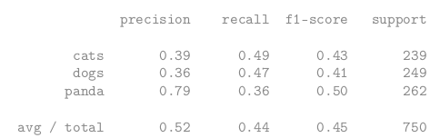

# Deep learning Sandbox
A deep learning utilities library for my experiments and development. Free to use by all. 


# Table of contents
1. [Utility functions](#utility_functions)
2. [Experiments](#experiments)
    1. [k-NN: A Simple Classifier](#knn)
    2. [Parameterized Learning (Linear Regression)](#linear_regression)


## Utility functions <a name="utility_functions"></a>
1. **Preliminary Dataset loader:** 
   - This dataset loader is simple by design; however, it affords us the ability to apply any number of image preprocessors to every image in our dataset with ease. The only caveat of this dataset loader is that it assumes that all images in the dataset can fit into main memory at once. (To be expanded upon soon)


```
 simpleDatasetloader.py
 simplePreprocessor.py
```


## Experiments: <a name="experiments"></a>
### **1. **k-NN: A Simple Classifier**** <a name="knn"></a>
```
$ python knn.py --dataset ../datasets/animals
```

On a set of 3000 images of cats vs. dogs vs. pandas: 



One main advantage of the k-NN algorithm is that **it’s extremely simple to implement and understand**. Furthermore, the classifier takes absolutely no time to train, since all we need to do is store our data points for the purpose of later computing distances to them and obtaining our final classification.

However, we pay for this simplicity at classification time. **Classifying a new testing point requires a comparison to every  single data point in our training data, which scales O(N)**, making
working with larger datasets computationally prohibitive.

Given these cons, why bother even studying the k-NN algorithm? The reason is that the
algorithm is simple. It’s easy to understand. And most importantly, it gives us a baseline that we can use to compare neural networks and Convolutional Neural Networks.

- [ ] Future Enhancement: Utilizing Nvidia Rapids cuML

### **2. Parameterized Learning** <a name="linear_regression"></a>

There are two primary advantages to utilizing parameterized learning:
1. Once we are done training our model, **we can discard the input data and keep only the weight matrix W and the bias vector b**. This substantially reduces the size of our model since we need to store two sets of vectors (versus the entire training set).
   
2. **Classifying new test data is fast**. In order to perform a classification, all we need to do is take the dot product of W and x i , follow by adding in the bias b (i.e., apply our scoring function). Doing it this way is significantly faster than needing to compare each testing point to every training example, as in the k-NN algorithm.

```
$ python linear_classifier.py
```

In practice, you would never initialize your W and b values and assume they would give you the correct classification without some sort of learning process. Instead, when training our own machine learning models from scratch we would need to optimize and learn W and b via an optimization algorithm, such as gradient descent. The code is for my own sake of notetaking. 

